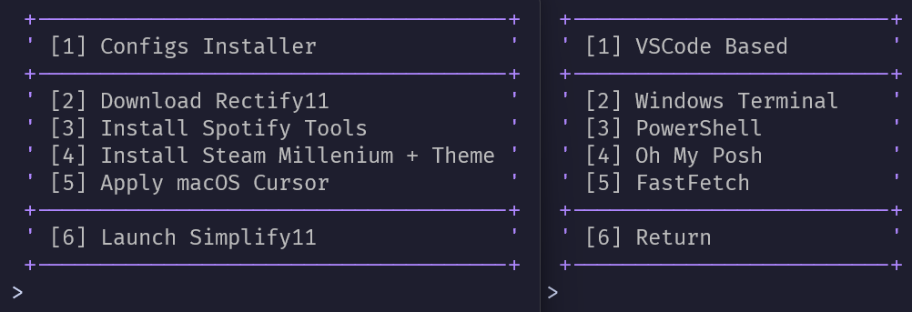

<!--
gallery for md
spicetify theme + plugins
flowlauncher config
-->

<h1 align="center">✨ Windots </h1>

<br>

<br/><br/>

## 🌟 About

Collection of configurations and tools to transform your Windows 11 into an elegant and productive environment

## 🚀 Setup

### Quick Launch

```powershell
iwr "https://dub.sh/windots" | iex
```

## 🛠️ Features

After launching the script, you'll get an interactive menu:

1. **Configs Installer** - install configurations on your choice for:

   - [VSCode](https://code.visualstudio.com/) and most popular forks
   - [Windows Terminal](https://github.com/microsoft/terminal)
   - [PowerShell](https://learn.microsoft.com/en-us/powershell/)
   - [Oh My Posh](https://ohmyposh.dev/)
   - [FastFetch](https://github.com/fastfetch-cli/fastfetch)

2. **Additional Stuff**:

- Download [Rectify11](https://rectify11.net/)
- Install [SpotX](https://github.com/SpotX-Official/SpotX) + [Spicetify](https://spicetify.app/)
- Install [Steam Millennium](https://steambrew.app/) with [Space Theme](https://github.com/SpaceTheme/Steam)
- Apply [macOS-style cursors](https://github.com/ful1e5/apple_cursor)
- Launch [Simplify11](https://github.com/emylfy/Simplify11)

### 💻 Dotfiles Configurations

| Component            | Support                                                                                                                                                                                  |
| -------------------- | ---------------------------------------------------------------------------------------------------------------------------------------------------------------------------------------- |
| **Code Editors**     | [VSCode](https://code.visualstudio.com/), [AIDE](https://github.com/codestoryai/aide), [Cursor](https://cursor.sh/), [Windsurf](https://windsurf.io/), [VSCodium](https://vscodium.com/) |
| **Terminal**         | [Windows Terminal](https://github.com/microsoft/terminal) + [Oh My Posh](https://ohmyposh.dev/) + [PowerShell](https://learn.microsoft.com/en-us/powershell/)                            |
| **System Utilities** | [FastFetch](https://github.com/fastfetch-cli/fastfetch), [Flow Launcher](https://www.flowlauncher.com/), [PowerToys](https://learn.microsoft.com/windows/powertoys/)                     |
| **Gaming**           | [Steam Millennium](https://steambrew.app/) + [Space Theme](https://github.com/SpaceTheme/Steam?tab=readme-ov-file#)                                                                      |
| **Theming**          | [macOS Cursors](https://github.com/ful1e5/apple_cursor)                                                                                                                                  |

### 🖥️ Apps without Dotfiles

| Category   | Tools                                                                                                                                                                    |
| ---------- | ------------------------------------------------------------------------------------------------------------------------------------------------------------------------ |
| **Web**    | 🌐 [Arc Browser](https://thebrowser.company/)<br>🧘 [Zen Browser](https://zen.team/) ([startpage](https://github.com/mue/mue?tab=readme-ov-file#mue))                    |
| **System** | 🚀 [Flow Launcher](https://www.flowlauncher.com/)<br> 🛠️ [PowerToys](https://learn.microsoft.com/windows/powertoys/)<br> 🗜️ [NanaZip](https://github.com/M2Team/NanaZip) |
| **Media**  | 🎶 [SpotX](https://github.com/SpotX-Official/SpotX) + [Spicetify](https://spicetify.app/) <br> 🖼️ [WinDynamicDesktop](https://www.windynamicdesktop.com/)                |
